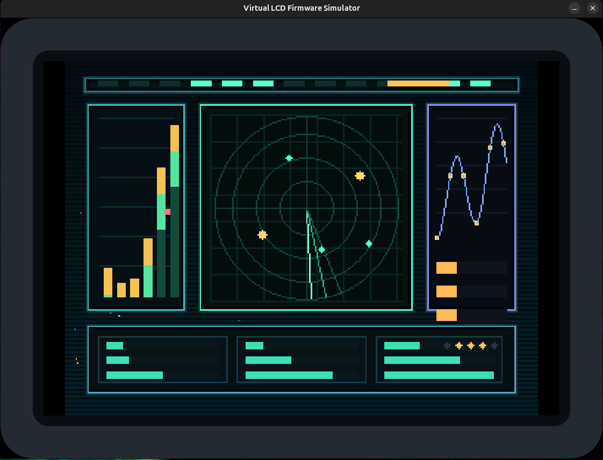
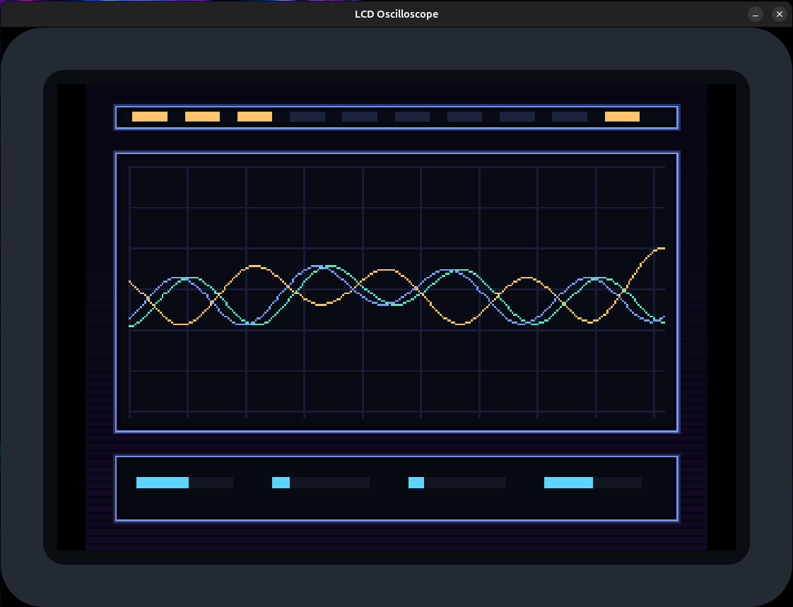
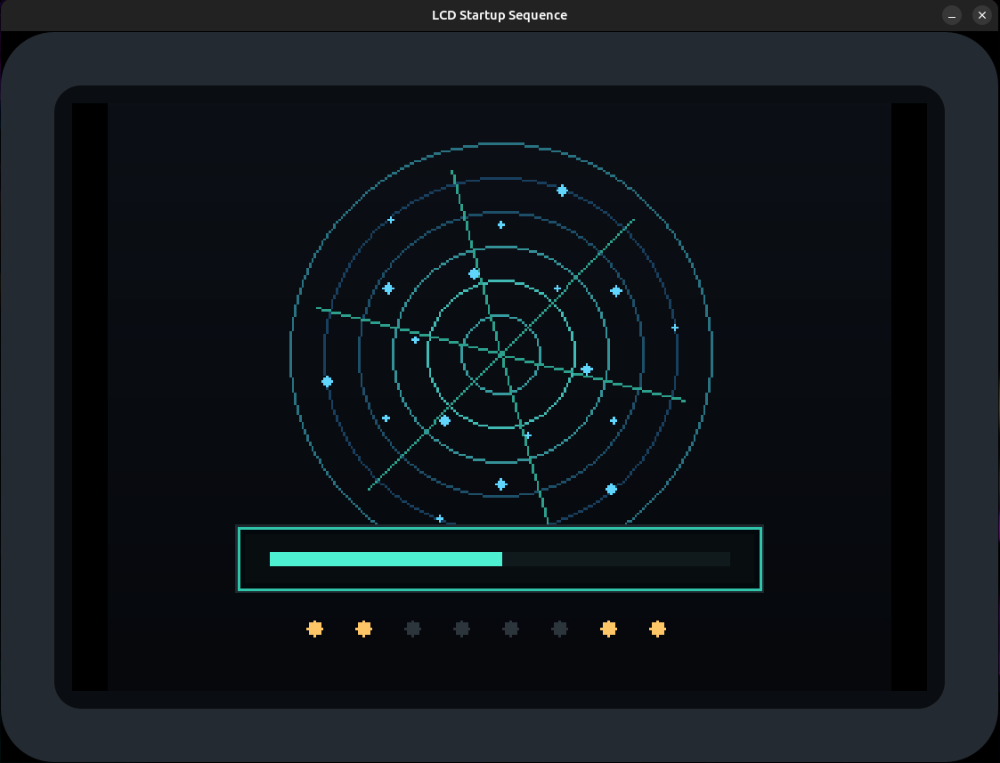
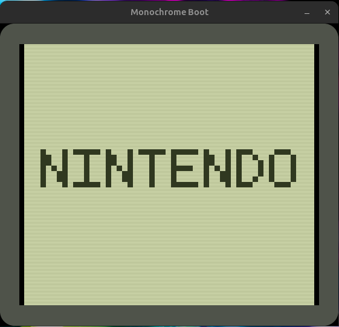
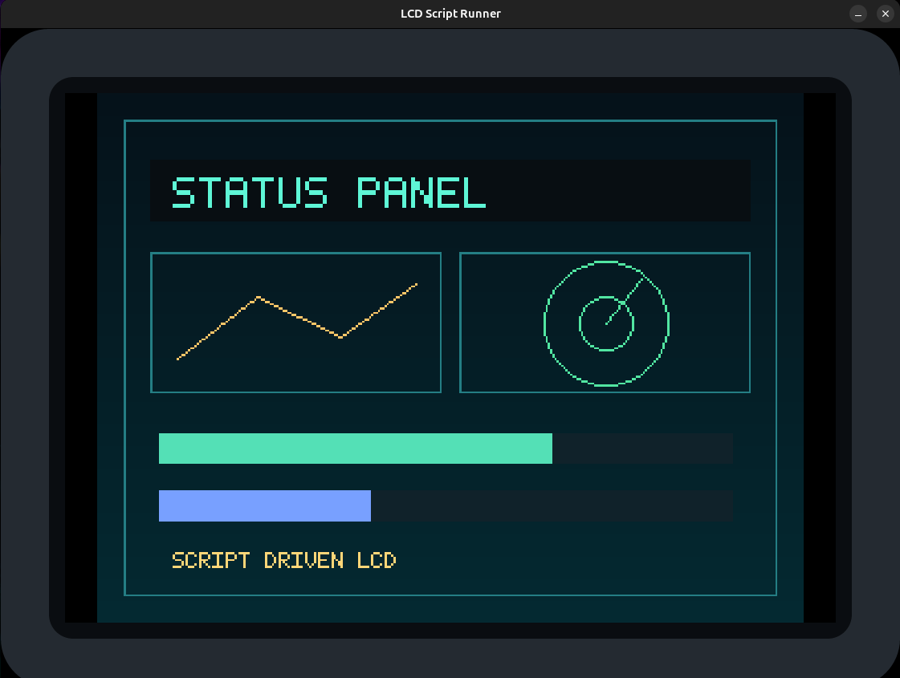

# Virtual LCD Firmware Simulator

SDK para simular display LCD em Rust.

## Publicação no crates.io

Os módulos de biblioteca do projeto já estão publicados no `crates.io`:

- `virtual-lcd-sdk`: <https://crates.io/crates/virtual-lcd-sdk> | docs: <https://docs.rs/virtual-lcd-sdk>
- `virtual-lcd-core`: <https://crates.io/crates/virtual-lcd-core> | docs: <https://docs.rs/virtual-lcd-core>
- `virtual-lcd-renderer`: <https://crates.io/crates/virtual-lcd-renderer> | docs: <https://docs.rs/virtual-lcd-renderer>

## Arquitetura:

- `virtual-lcd-core`: estado do display, framebuffer, timing e comandos.
- `virtual-lcd-sdk`: API usada pelos exemplos como se fosse o driver do hardware.
- `virtual-lcd-renderer`: janela Linux que desenha o framebuffer dentro das molduras SVG da pasta `frames/`.
- `virtual-lcd-examples`: demos e binários de exemplo para validar o renderer e o core.

## Extensões de hardware

O simulador suporta o conceito de extensões de hardware. 
Cada extensão muda o comportamento do firmware virtual para representar um controlador LCD real, com registradores, comandos e leitura de estado próprios.

Extensões atualmente implementadas:

- `ili9341`
- `ssd1306`

## Execução de testes

```bash
cargo test
```

## Publicação automática

O workflow `.github/workflows/publish-crates.yml` foi preparado para publicar automaticamente no `crates.io` sempre que houver push na branch `main`.

Fluxo do workflow:

- incrementa automaticamente a versão patch dos crates `virtual-lcd-*`
- roda `cargo test`
- cria um commit com o bump de versão e faz `git push`
- autentica no `crates.io` com Trusted Publishing via `rust-lang/crates-io-auth-action@v1`
- publica `virtual-lcd-sdk`, `virtual-lcd-core` e `virtual-lcd-renderer` em sequência

Configuração única necessária no `crates.io`, por crate:

- owner: `fhfelipefh`
- repo: `Virtual-LCD-Firmware-Simulator`
- workflow: `publish-crates.yml`

Depois dessa configuração, novos pushes no `main` passam a gerar novas versões automaticamente.

## Exemplos disponíveis

### `dashboard`

Painel técnico com radar, barras, gráfico e cartões de status.

```bash
cargo run -p virtual-lcd-examples --bin dashboard
```



### `oscilloscope`

Grade de medição com três ondas animadas.

```bash
cargo run -p virtual-lcd-examples --bin oscilloscope
```



### `startup`

Tela de inicialização com anéis, órbitas e barra de progresso.

```bash
cargo run -p virtual-lcd-examples --bin startup
```



### `gameboy`

Boot monocromático simples, com tela verde e descida da palavra `NINTENDO`.

```bash
cargo run -p virtual-lcd-examples --bin gameboy
```



### `scripted`

Executa um arquivo de texto com comandos simples de desenho.

```bash
cargo run -p virtual-lcd-examples --bin scripted -- virtual-lcd-examples/scripts/panel.lcd
```



### `scripted` com `ssd1306`

Exemplo OLED ocupando os `128x64` pixels da tela e exercitando todas as instruções suportadas pelo parser. Como o `ssd1306` é monocromático, qualquer cor usada abaixo é quantizada para preto e branco no framebuffer final:

```bash
cargo run -p virtual-lcd-examples --bin scripted -- virtual-lcd-examples/scripts/oled.lcd
```

```text
controller ssd1306
canvas 128 64
frame auto
clear 0 0 0
gradient 0 0 128 64 0 0 0 255 255 255
rect 0 0 128 64 255 255 255
fill_rect 6 6 116 14 255 255 255
line 0 63 127 0 255 255 255
circle 96 38 16 255 255 255
text 12 10 1 0 0 0 SSD1306 FULL
text 8 48 1 255 255 255 RECT LINE CIRCLE
```

### `scripted` com `ili9341`:

Exemplo colorido para `320x240`, também usando a resolução máxima da controladora e cobrindo todas as instruções suportadas:

```bash
cargo run -p virtual-lcd-examples --bin scripted -- virtual-lcd-examples/scripts/ili9341.lcd
```

```text
controller ili9341
canvas 320 240
frame auto
clear 8 14 18
gradient 0 0 320 240 8 20 30 6 56 74
rect 0 0 320 240 40 124 136
fill_rect 18 18 284 34 7 15 20
text 28 28 2 96 246 214 ILI9341 DEMO
rect 18 70 136 76 36 126 132
fill_rect 28 80 116 56 12 34 42
line 28 136 144 80 255 198 104
rect 166 70 136 76 36 126 132
circle 234 108 30 82 230 162
line 204 108 264 108 82 230 162
line 234 78 234 138 82 230 162
fill_rect 18 164 284 20 16 34 42
fill_rect 18 164 208 20 84 224 182
text 24 196 1 255 214 120 CLEAR GRADIENT RECT FILL RECT
text 24 212 1 120 220 255 LINE CIRCLE TEXT FRAME CANVAS
```

## Molduras SVG

As molduras ficam em `frames/` e são usadas só como entrada visual do renderer. Hoje o projeto já traz opções para:

- `1:1`
- `4:3`
- `16:9`
- `21:9`
- `9:16`

O renderer escolhe a moldura pelo aspect ratio do LCD e desenha a imagem útil dentro da área interna do SVG.

## Scripts de LCD

O bin `scripted` lê um arquivo texto linha por linha e converte isso em chamadas para o LCD. O arquivo de exemplo está em `virtual-lcd-examples/scripts/panel.lcd`.

Comandos suportados:

- `canvas <largura> <altura>`
- `controller generic|ili9341|ssd1306`
- `frame auto|handheld`
- `clear r g b`
- `gradient x y w h r1 g1 b1 r2 g2 b2`
- `fill_rect x y w h r g b`
- `rect x y w h r g b`
- `line x0 y0 x1 y1 r g b`
- `circle cx cy raio r g b`
- `text x y escala r g b MENSAGEM`

## Estrutura

```text
virtual-lcd-core/
virtual-lcd-sdk/
virtual-lcd-renderer/
virtual-lcd-examples/
frames/
imgs/
```
