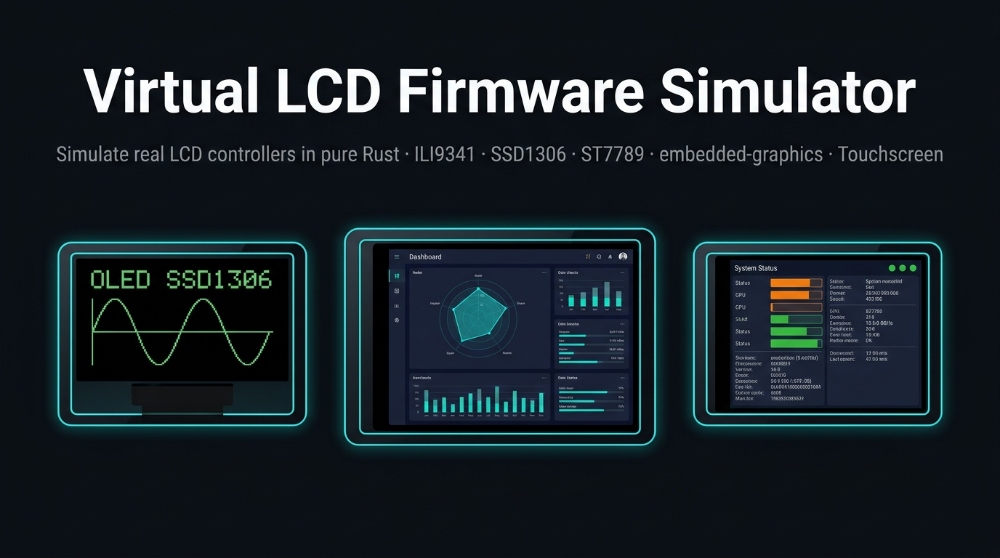
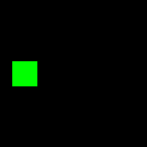
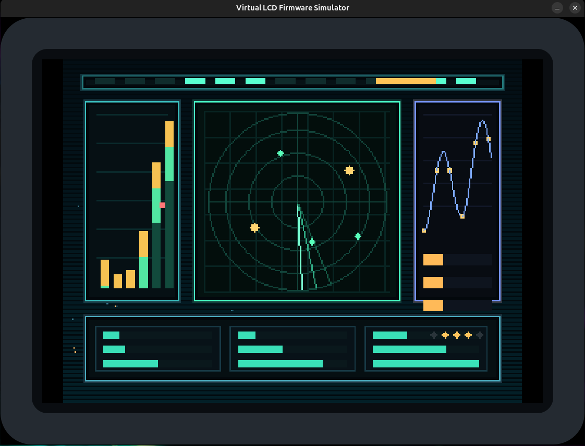
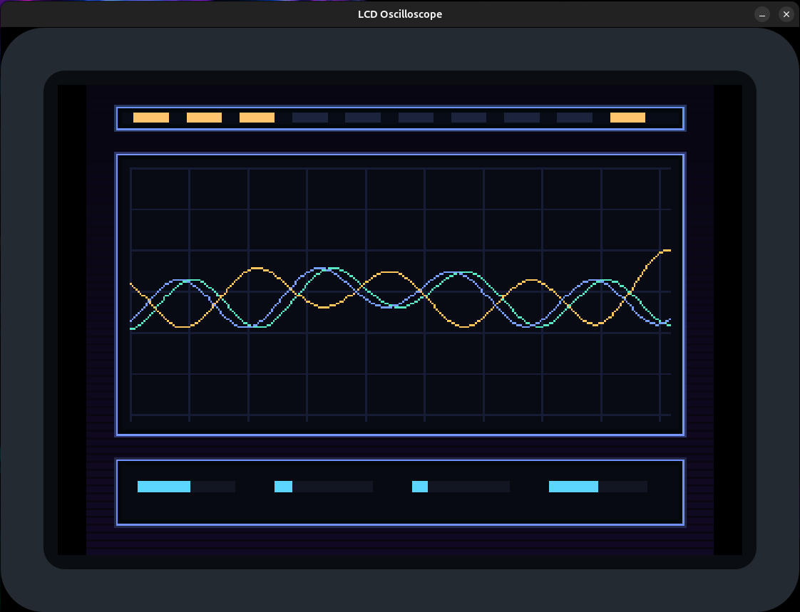
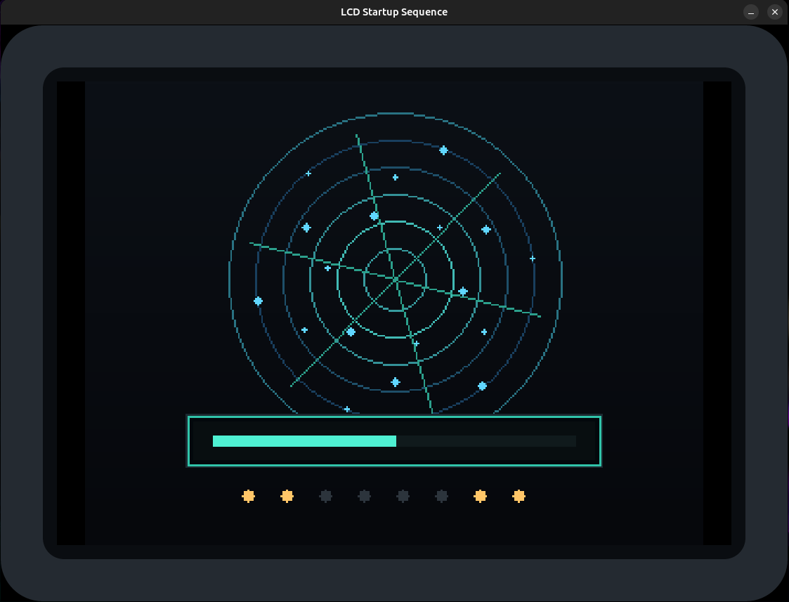
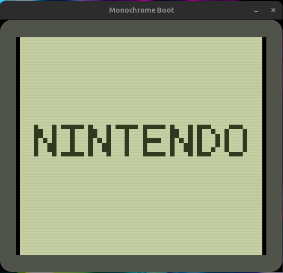
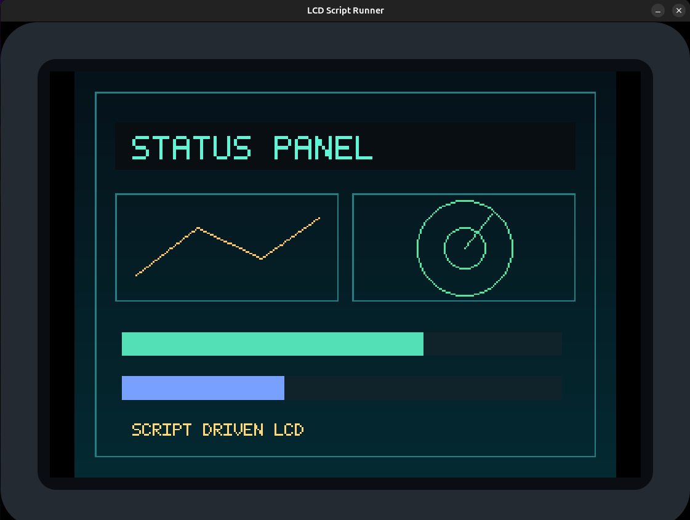

<p align="center">
  
</p>

<p align="center">
  <a href="https://crates.io/crates/virtual-lcd-core"></a>
  <a href="https://crates.io/crates/virtual-lcd-sdk"></a>
  <a href="https://docs.rs/virtual-lcd-core"></a>
  
  
</p>

**Virtual LCD Firmware Simulator** is a pure-Rust library that lets you run and test LCD firmware without any physical hardware. It faithfully emulates real display controllers at the bus level — including SPI chip-select semantics, command/data sequencing, pixel format conversion, and timing — so your firmware code runs identically against the simulator and the real chip.

---

## ✨ Features

| Feature | Description |
| --- | --- |
| 🖥️ **Multiple controllers** | `ILI9341`, `SSD1306`, `ST7789`, `GenericMipiDcs` |
| 🎨 **embedded-graphics** | `DrawTarget` integration via `virtual-lcd-embedded-graphics` |
| 👆 **Virtual touchscreen** | Mock FT6236 I2C touch controller with multi-point events |
| 🪟 **Desktop renderer** | Real-time window via `minifb` with SVG display frames |
| 🌐 **WebAssembly** | Render to `<canvas>` in the browser |
| 🧪 **Snapshot tests** | Pixel-accurate regression tests with the `image` crate |
| ⚡ **Pixel format** | RGB565, RGB888, monochrome (SSD1306) |
| 🔄 **Double buffering** | Single & double buffer modes with FPS-based timing |

---

## 📦 Crates

| Crate | crates.io | docs.rs | Description |
| --- | --- | --- | --- |
| `virtual-lcd-core` | [](https://crates.io/crates/virtual-lcd-core) | [](https://docs.rs/virtual-lcd-core) | Display state, framebuffer, bus emulation, controllers |
| `virtual-lcd-sdk` | [](https://crates.io/crates/virtual-lcd-sdk) | [](https://docs.rs/virtual-lcd-sdk) | `LcdBus` trait, `PinId`, shared types for firmware drivers |
| `virtual-lcd-embedded-graphics` | — | — | `DrawTarget` impl for `embedded-graphics` ecosystem |
| `virtual-lcd-renderer` | [](https://crates.io/crates/virtual-lcd-renderer) | [](https://docs.rs/virtual-lcd-renderer) | Desktop window renderer with SVG display frames |

---

## 🏗️ Architecture

```text
┌─────────────────────────────────────────────────────┐
│                  Your Firmware Code                 │
│        (uses LcdBus trait from virtual-lcd-sdk)     │
└───────────────────┬─────────────────────────────────┘
                    │ SPI / I2C / Parallel commands
                    ▼
┌─────────────────────────────────────────────────────┐
│                  virtual-lcd-core                   │
│  ┌──────────┐  ┌──────────┐  ┌──────────────────┐  │
│  │ ILI9341  │  │ SSD1306  │  │     ST7789       │  │
│  │controller│  │controller│  │   controller     │  │
│  └──────────┘  └──────────┘  └──────────────────┘  │
│         ┌──────────────────────────┐               │
│         │   Framebuffer (RGB/Mono) │               │
│         └──────────────────────────┘               │
└──────────────┬──────────────────────────────────────┘
               │
    ┌──────────┴──────────────────────────┐
    │                                     │
    ▼                                     ▼
virtual-lcd-renderer             virtual-lcd-web (WASM)
  (minifb window)                 (canvas rendering)
```

---

## 🚀 Quick Start

Add to your `Cargo.toml`:

```toml
[dependencies]
virtual-lcd-core = "0.1"
virtual-lcd-sdk = "0.1"
```

Simulate an ILI9341 display with a firmware-style init sequence:

```rust
use virtual_lcd_core::{VirtualLcd, LcdConfig, ControllerModel, PixelFormat, InterfaceType, BufferingMode};
use virtual_lcd_sdk::{LcdBus, PinId};

fn main() {
    let mut lcd = VirtualLcd::new(LcdConfig {
        controller: ControllerModel::Ili9341,
        width: 240,
        height: 320,
        pixel_format: PixelFormat::Rgb565,
        fps: 60,
        interface: InterfaceType::Spi4Wire,
        bus_hz: 40_000_000,
        orientation: 0,
        vsync: false,
        buffering: BufferingMode::Single,
        backlight: true,
        tearing_effect: false,
    }).unwrap();

    // Real firmware-style SPI sequence
    lcd.set_pin(PinId::Cs, false).unwrap();   // CS low = select
    lcd.set_pin(PinId::Rst, true).unwrap();   // RST high = not in reset

    lcd.write_command(0x01).unwrap(); // SWRESET
    lcd.write_command(0x11).unwrap(); // SLPOUT
    lcd.write_command(0x29).unwrap(); // DISPON
    lcd.write_command(0x3A).unwrap();
    lcd.write_data(&[0x55]).unwrap(); // COLMOD: RGB565

    // Set column address (0..239)
    lcd.write_command(0x2A).unwrap();
    lcd.write_data(&[0x00, 0x00, 0x00, 0xEF]).unwrap();

    // Set page address (0..319)
    lcd.write_command(0x2B).unwrap();
    lcd.write_data(&[0x00, 0x00, 0x01, 0x3F]).unwrap();

    // Write pixel data (red)
    lcd.write_command(0x2C).unwrap();
    let red_pixel: &[u8] = &[0xF8, 0x00]; // RGB565 red
    lcd.write_data(&red_pixel.repeat(240 * 320)).unwrap();

    lcd.set_pin(PinId::Cs, true).unwrap(); // CS high = deselect

    // Advance timing simulation
    lcd.tick();
}
```

---

## 🎨 embedded-graphics Integration

Use the `virtual-lcd-embedded-graphics` crate to draw shapes, text and images using the `embedded-graphics` ecosystem:

```rust
use virtual_lcd_embedded_graphics::LcdDisplay;
use embedded_graphics::{
    mono_font::{ascii::FONT_9X18_BOLD, MonoTextStyle},
    pixelcolor::Rgb565,
    prelude::*,
    primitives::{Circle, PrimitiveStyleBuilder, Rectangle},
    text::Text,
};

let mut display = LcdDisplay::new(lcd);

// Draw a filled blue circle
Circle::new(Point::new(100, 100), 80)
    .into_styled(PrimitiveStyleBuilder::new().fill_color(Rgb565::BLUE).build())
    .draw(&mut display).unwrap();

// Draw text
Text::new("Hello LCD!", Point::new(50, 200),
    MonoTextStyle::new(&FONT_9X18_BOLD, Rgb565::WHITE))
    .draw(&mut display).unwrap();
```

---

## 👆 Virtual Touchscreen

Simulate finger touches for testing touch-driven firmware:

```rust
use virtual_lcd_core::touch::{TouchState, TouchPoint};

// Simulate a finger press at (120, 160)
lcd.update_touch(TouchState {
    active: true,
    points: vec![TouchPoint { x: 120, y: 160 }],
});

// Read back via mock I2C (FT6236 register protocol)
let mut buf = [0u8; 14];
lcd.read_touch_i2c(0x38, 0x02, &mut buf).unwrap();
```

---

## 🧪 Snapshot Testing

The simulator includes pixel-accurate snapshot tests that verify controller rendering output using the [`image`](https://crates.io/crates/image) crate:

```rust
// virtual-lcd-core/tests/snapshot_tests.rs
#[test]
fn test_ili9341_snapshot() {
    let mut lcd = create_lcd(ControllerModel::Ili9341);
    lcd.set_pin(PinId::Cs, false).unwrap();
    lcd.set_pin(PinId::Rst, true).unwrap();
    // ... init sequence + draw red rectangle ...
    save_snapshot(&lcd, "ili9341_test_rect");
}
```

Run all tests with:

```bash
cargo test -p virtual-lcd-core
```

Generated snapshots in `virtual-lcd-core/tests/snapshots/`:

| Snapshot | Controller | Description |
| --- | --- | --- |
| `ili9341_test_rect.png` | ILI9341 240×320 | Red rectangle after CASET+PASET+RAMWR |
| `st7789_test_rect.png` | ST7789 240×240 | Green rectangle after CASET+RASET+RAMWR |

<p>
  
  
</p>

---

## 🖼️ Examples

### `dashboard` — Technical panel with radar, bars and chart

```bash
cargo run -p virtual-lcd-examples --bin dashboard
```



---

### `oscilloscope` — Animated tri-channel oscilloscope

```bash
cargo run -p virtual-lcd-examples --bin oscilloscope
```



---

### `startup` — Startup ring animation with progress bar

```bash
cargo run -p virtual-lcd-examples --bin startup
```



---

### `gameboy` — Monochrome boot screen (SSD1306)

```bash
cargo run -p virtual-lcd-examples --bin gameboy
```



---

### `scripted` — Text-file driven LCD renderer

```bash
cargo run -p virtual-lcd-examples --bin scripted -- virtual-lcd-examples/scripts/panel.lcd
```



LCD script syntax:

```text
controller ili9341
canvas 320 240
frame auto
clear 8 14 18
gradient 0 0 320 240  8 20 30  6 56 74
fill_rect 18 18 284 34  7 15 20
text 28 28 2  96 246 214  ILI9341 DEMO
line 28 136 144 80  255 198 104
circle 234 108 30  82 230 162
```

Supported commands: `canvas`, `controller`, `frame`, `clear`, `gradient`, `fill_rect`, `rect`, `line`, `circle`, `text`

---

## 🌐 WebAssembly Viewer

Build and serve the WASM viewer locally:

```bash
# Build the WASM package
wasm-pack build virtual-lcd-web --target web --dev --out-dir ../web/pkg

# Serve
cd web && python3 -m http.server 8080
```

Open `http://localhost:8080` — supports dashboard, oscilloscope, startup, gameboy scenes and inline script execution.

---

## 📐 Display Frames

SVG frames in `frames/` are matched by aspect ratio at runtime:

| Frame | Aspect |
| --- | --- |
| `1:1` | Square OLED |
| `4:3` | Classic LCD |
| `16:9` | Widescreen |
| `21:9` | Ultrawide |
| `9:16` | Portrait |

---

## 📁 Project Structure

```text
virtual-lcd-core/              # Display state, framebuffer, bus emulation, controllers
  src/
    lib.rs                     # VirtualLcd struct and core logic
    config.rs                  # LcdConfig, PixelFormat, InterfaceType
    state.rs                   # LcdState (display on/off, sleep, MADCTL, scroll)
    bus.rs                     # SPI/I2C bus state machine
    touch.rs                   # TouchState and FT6236 mock
    controllers/               # Per-controller logic (ILI9341, SSD1306, ST7789)
  tests/
    snapshot_tests.rs          # Pixel-accurate regression tests
    snapshots/                 # Generated PNG snapshots (committed as baselines)

virtual-lcd-sdk/               # LcdBus trait, PinId, shared types
virtual-lcd-embedded-graphics/ # embedded-graphics DrawTarget adapter
virtual-lcd-renderer/          # minifb desktop window renderer
virtual-lcd-web/               # WASM renderer for canvas
virtual-lcd-examples/          # Runnable demos
frames/                        # SVG display bezels
imgs/                          # Screenshots for README
web/                           # Static HTML/JS for browser viewer
```

---

## 📄 License

MIT — see [LICENSE](LICENSE).
